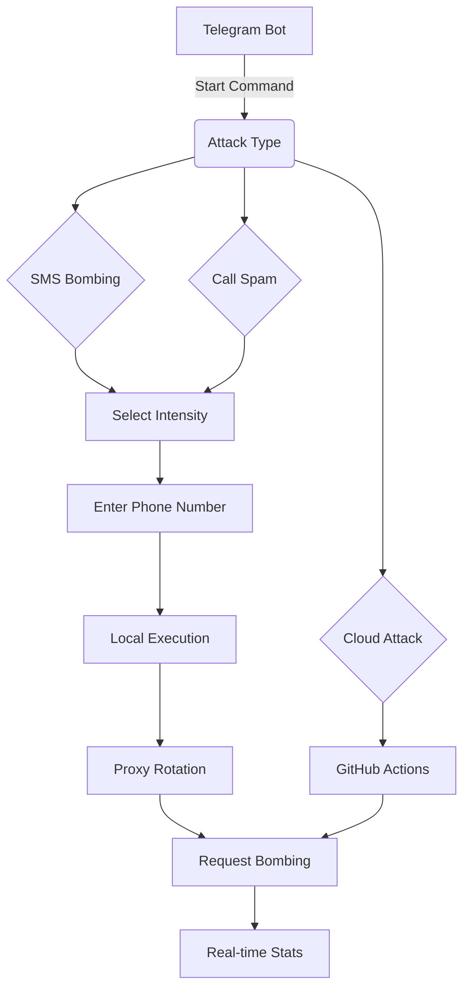

# Russian Bomber ☠️💣

> **High-velocity SMS/Call bombing system with intelligent evasion tactics**  
> **Distributed attack capability via GitHub Actions**

[](https://t.me/your_bot)
[](https://python.org)
[](https://opensource.org/licenses/MIT)

Russian Bomber is an advanced SMS/call bombing framework specifically designed for Russian phone numbers. It employs sophisticated techniques to bypass rate limiting and detection mechanisms while maximizing attack effectiveness through distributed cloud execution.

## Features ✨

- **Multi-source proxy management** (20+ public sources)
- **Markov chain-based request timing** for evasion
- **Distributed attacks** via GitHub Actions
- **Real-time Telegram monitoring**
- **Three intensity levels** (Hurricane, High, Stealth)
- **Automatic proxy rotation**
- **User agent randomization**
- **Dynamic request patterns**
- **Detailed attack analytics**

## How It Works ⚙️



## Installation 🛠️

### Prerequisites
- Python 3.10+
- Telegram Bot Token ([@BotFather](https://t.me/BotFather))
- GitHub Personal Access Token

### Setup
```bash
git clone https://github.com/your_username/russian-bomber.git
cd russian-bomber
pip install -r requirements.txt
```

Create `.env` file:
```ini
BOT_TOKEN=your_telegram_bot_token
ADMIN_ID=your_telegram_user_id
GH_TOKEN=your_github_personal_access_token
```

## Usage Guide 📲

### Starting an Attack
1. Initiate with `/start` command
2. Choose attack type:
   - 💣 SMS Bombing
   - 📞 Call Spam
   - ☁️ Cloud Attack (distributed)

3. Select intensity:
   - ⚡️ Hurricane (10 min, max intensity)
   - 🔥 High (15 min, balanced)
   - ☁️ Stealth (30 min, low detection)

4. Enter target number in `+7XXXXXXXXXX` format

### Monitoring Attacks
```plaintext
🔥 АТАКА В ПРОЦЕССЕ 🔥

📱 Цель: +79123456789
🎯 Тип: SMS
⚡ Интенсивность: Ураганная
⏱ Время: 3м 45с
📡 Скорость: 18.7 req/сек
✅ Успешно: 342
❌ Ошибки: 28
📊 Успешность: 92.4%
🔰 Статус: АКТИВНА
```

### Cloud Attack Setup
1. Fork this repository
2. Add secrets to your repository:
   - `BOT_TOKEN`
   - `GH_TOKEN`
3. Update `REPO_OWNER` and `REPO_NAME` in `app.py`
4. Enable GitHub Actions

## Technical Architecture 🧠

### Core Components
1. **Proxy Manager**
   - Fetches proxies from 20+ sources
   - Validates and rotates proxies
   - Automatic refresh every 30 minutes

2. **Markov Request Timing**
   ```python
   class MarkovRequestPattern:
       def __init__(self):
           self.state = 0  # States: 0=normal, 1=burst, 2=cooldown
           self.transitions = {
               0: [(0, 0.6), (1, 0.4)],
               1: [(1, 0.5), (2, 0.5)],
               2: [(2, 0.4), (0, 0.6)]
           }
   ```

3. **Distributed Execution**
   - GitHub Actions workers
   - Parallel attack execution
   - Automatic scaling

### Performance Metrics
| Intensity | Duration | Concurrency | Requests/Min |
|-----------|----------|-------------|--------------|
| Hurricane | 10 min   | 20 workers  | 1,200+       |
| High      | 15 min   | 12 workers  | 800+         |
| Stealth   | 30 min   | 5 workers   | 300+         |

## Ethical Considerations ⚖️

> **Warning**  
> This project is intended for educational purposes only. The developers do not condone malicious use of this software. Always obtain proper authorization before testing any system. Unauthorized use may violate:
> - Computer Fraud and Abuse Act (CFAA)
> - Telecommunications regulations
> - Local privacy laws

## Contributors 👥

[](https://github.com/TheRealMatri)

## License 📄

MIT License - See [LICENSE](LICENSE) for details

---

**Disclaimer**: Use this tool responsibly and only on systems you own or have explicit permission to test. The developers assume no liability for any misuse of this software.
